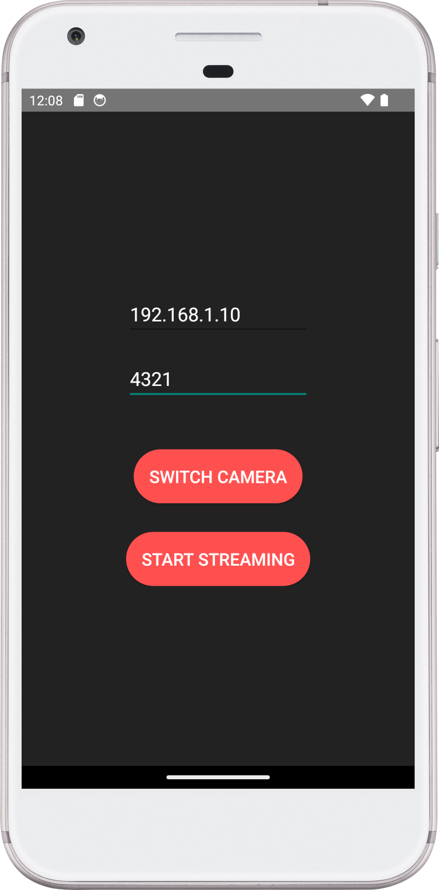

# Phonecam

[](https://github.com/zenoxygen/phonecam/actions/workflows/ci.yaml)

Phonecam is an Android app that streams live video from the device's camera to a server.



## Features

- Connect to a server via IP address and port
- Stream live video from the device's camera
- Switch to front or back camera
- Save the last used IP address and port

## Installation

### Requirements

- Android device or emulator with API level 28 minimum (Android 9.0 / Pie)

### Android Studio

Clone this repository:

```sh
git clone https://github.com/zenoxygen/phonecam.git
```

Open the project in Android Studio:

```
File -> Open -> Phonecam
```

Build the project:

```
Build -> Make Project
```

Run the app on your device or emulator:
```
Run -> Run 'app'
```

## License

Phonecam is distributed under the terms of the [MIT License](LICENSE).
